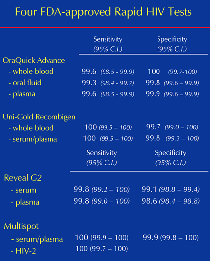

<span style="color:red">Please submit your lab report by renaming this R Markdown file as "Lab4LastnameFirstname.Rmd" **(please replace Lastname and Firstname with your last and first names, respectively; please do not add spaces, hyphens, or underscores)** and uploading it to the appropriate Lab 4 submission link on Chalk. Please provide answers in this document in the form of <span style="color:blue">blue text</span> and
```{r eval = FALSE}
code chunks #with comments when necessary
```
<span style="color:red">to all green questions. </span>

## Part I: ELISA

For the first portion of this lab, pick up the ELISA packet instructions from the front of the lab room. 

## Part II: Conditional Probability

For this portion of the lab, we will need to use Bayes' Theorem: $$P(A|B)=\frac{P(B|A)P(A)}{P(B)}$$

In epidemiology, the <span style="color:blue">prevalence</span> or <span style="color:blue">prevalence proportion</span> is the proportion of a population found to have a condition (typically a disease or a risk factor such as smoking or seat-belt use). It is arrived at by comparing the number of people found to have the condition with the total number of people studied, and is usually expressed as a fraction or a percentage.

<span style="color:blue">Sensitivity</span> of a test relates to the test's ability to identify positive results: the proportion of people that test positive for a disease out of all the people who actually have the disease. (<span style="color:blue">$Pr[+|Disease]$</span>). 

$$\text{Sensitivity}=\frac{\#\text{of true positives}}{\#\text{of true positives} + \#\text{of false negatives}}=P(+|\text{Disease})$$

<span style="color:blue">Specificity</span> relates to the test's ability to identify negative results: the proportion of patients that test negative for a disease out of all the people who are known not to have the disease. (<span style="color:blue">$Pr[-|\text{No Disease}]$</span>).

$$\text{Specificity}=\frac{\#\text{of true negatives}}{\#\text{of true negatives}+\#\text{of false positives}}=P(-|\text{No Disease})$$

The <span style="color:blue">positive predictive value (PPV)</span> of a test is the probability that a subject has a disease given that the subject has a positive test result (<span style="color:blue">$Pr[\text{Disease}|+]$</span>).

The <span style="color:blue">negative predictive value (NPV)</span> of a test is the probability that a subject does not have the disease, given that the subject has a negative test result (<span style="color:blue">$Pr[\text{No Disease}|-]$</span>).

Both the sensitivity and specify of the HIV tests are rather high, as indicated by a CDC report (Bernard M. Branson, 2005)

<center>

</center>

Let's look at some scenarios. <span style="color:blue">**In all of the following questions show your calculations to receive full credit.** You can do your work for this section by hand and then turn in your paper before leaving lab.</span>

<span style="color:green">
1. Based on the OraQuick Advantage plasma test, suppose a patient tests positive for HIV. Use the table above to find the sensitivity and specificity of the test and **TABLE 1** of the provided CDC report (p.184 of HIV-Prevalence.pdf) to find the prevalence of HIV among different populations.</span>

<span style="color:green">
a) If the patient has not used crack cocaine in the past 12 months, what is the probability that the patient actually has the disease?</span>

<span style="color:green">
b) Consider a different patient who is female. What is the probability that she actually has the disease?</span>

<span style="color:green">
2. What is the relationship between the prevalence of HIV among different populations and the positive predictive value of the OraQuick Advantage plasma test? Explain your answer.</span>

<span style="color:green">
3. Based on the Reveal G2 plasma test, suppose that a patient tests negative for HIV. Use the table above to find the sensitivity and specificity of the test and **TABLE 1** to find the prevalence of HIV among different populations. **Take all calculations out to at least four decimal places.**</span>

<span style="color:green">
a) If the patient is female, what is the probability that she is actually healthy?</span> 

<span style="color:green">
b) Consider a different patient who is disabled, what is the probability that the patient is actually healthy?</span>

<span style="color:green">
4. What is the relationship between the prevalence of the HIV among different populations and the negative predictive value of the Reveal G2 serum test? Explain your answer.</span>

## Part III: ELISA Analysis

After 40 minutes have passed, return to your microtiter plate and read the absorbances for your samples with the Micro Plate Reader. Use your results to answer the following questions.

### Questions

<span style="color:green">
5. From your data, which patients would you classify as having HIV? Not having HIV?</span>

<span style="color:green">
6. Suppose that you learn through a more reliable methodology that patient 4 does in fact have HIV; what type of error result occurred in your test? Explain. </span>

<span style="color:green">
7. Propose one possible biological mechanism to explain this type of error result from question 6.</span>

<span style="color:green">
8. A new technology is invented that is 100\% accurate. This new test identifies patient 3 as being HIV negative. What type of error result occurred in your test? Explain. </span>

<span style="color:green">
9. Propose one possible biological mechanism to explain the error result from question 8.</span>

<span style="color:green">
10. Describe how an ELISA indirectly detects infection by a disease causing agent. (If you're not sure, read the ELISA overview for the lab.)</span>

<span style="color:green">
11. When performing an ELISA, why do we need the secondary antibody and chromagen?</span>

## Part IV: Vectors and Matrices

A thorough understanding of vectors and matrices is crucial for performing statistical analyses in R and in many programming languages. We will be using the techniques and concepts introduced below in Lab 6 (with regard to Markov chains), so please ensure that you carefuly consider the following material and questions.

### Vector Refresher

Remember that vectors are variables that hold multiple values. Unlike data frames, vectors can only contain a specific data type (i.e. numeric, character, factor, etc.), or "class" in R-terminology. 

```{r comment = ''}
myVector <- c('x', 'y', 'z')
class(myVector)
```

All elements of the above vector are characters (sometimes referred to as strings).

```{r comment = ''}
myVector <- c(1, 2, 3)
```

All of the elements of this vector are of the type numeric. As you likely know by now, numeric values are ones on which we can perform arithmetic operations.
Execute the following bit of code (and save to your R script):

```{r comment = ''}
myNewVector <- c('y', 5)
```

<span style="color:green">
12.	Use the `class()` function to determine what type of vector `myNewVector` is. If we use `myNewVector[2]`, can we perform mathematical operations on the 5 that's in the vector? Explain this behavior.</span>

Remember that we can access specific elements of vectors by using brackets to *index*.

```{r comment = ''}
y <- 10:20
y[4]
```

<span style="color:green">
13.	Using the vector `y` above, multiply the second element of the vector `y` with the second to last element of the vector. Get the mean of the 2nd, 5th, 6th, and 8th elements of the vector. Do both of these using **only** indexing.
</span>

When performing simulations, which we will be doing later in this lab, **we often want to create empty vectors that will be used to store our results.** You likely have done this in previous labs and for aspects of your homework.

The following two commands will initialize empty numeric and character vectors with a size of 10:

```{r comment = ''}
numericVec <- numeric(10)
characterVec <- character(10)
```

<span style="color:green">
14.	What are the values assigned to the elements of these empty vectors?</span>

Lastly, as you should know by now, we can perform arithmetic operations on vectors that are the same length.

<span style="color:green">
15.	What happens when you try to multiply two vectors of unequal length? What happens when you try to multiply a character vector by a numeric vector? Provide examples.
</span>

### Introduction to Matrices 

A matrix is very similar to a data frame, except that all elements in a matrix have to be of the same type. In other words, matrices are very similar to vectors. There are many situations in which a vector is not sufficient to hold all of our data of interest.

Matrices can be created in the following way:

```{r comment = ''}
matrix(nrow = 2, ncol = 2, data = 1:4)
```

As you may have guessed, the `nrow` and `ncol` arguments dictate how many rows and columns there are in the matrix. The data argument takes a vector, and subsequently populates the elements of the matrix with the values in the vector. In R's matrix command there is a default argument `byrow`, which by default is set to `FALSE`. However, this can be overridden by the following:

```{r comment = ''}
matrix(nrow = 2, ncol = 2, data = 1:4, byrow =TRUE)
```

<span style="color:green">
16.	Do you see a difference in the two matrices? What do you think the `byrow` argument is doing?</span>

Above we specified a vector that was conveniently the same size as the number of elements in our matrix.

<span style="color:green">
17.	What happens when the vector we supply to the data argument contains MORE elements than the matrix does?</span>

<span style="color:green">
18.	What happens when the vector we supply to the matrix contains FEWER elements than the matrix does?</span>

Like vectors, matrices can be used with a lot of R's built-in functions. Create the following matrix.

```{r comment = ''}
x <- matrix(nrow = 5, ncol = 5, data = 1:25)
x
```

If we use the built-in R function `rowMeans()`, we can obtain the mean of each row of data in our matrix (returned as a vector).

```{r comment = ''}
rowMeans(x)
```

Similarly, the built-in function `colMeans()` will get us the means of each of the columns:

```{r comment = ''}
colMeans(x)
```

<span style="color:green">
19.	Try using some of the built-in functions you already know on this matrix (i.e. `mean()`, `sd()`, `sum()`, etc.). How is R performing these calculations (is it by row, by column, or all elements in the matrix?)</span>

Like we did for vectors, we could use `length()` to determine the number of elements in the matrix. However, this doesn't help us if we want to know the number of rows or the number of columns. Thankfully, there are built-in functions to help us with that also.

```{r comment = ''}
ncol(x)
nrow(x)
```

If we want to know the overall dimensions of the matrix, we can use the built-in function dim(), which will return a vector.

```{r comment = ''}
dim(x)
```

<span style="color:green">
20. Make a matrix of your own that contains a different number of rows and columns. Which element of the vector returned by `dim()` represents the number of rows? Which represents the number of columns?</span>

We can also access individual elements of our matrix. For the following exercises, create the following matrix:

```{r comment = ''}
testMatrix <- matrix(nrow = 3, ncol = 3, data = 1:9)
testMatrix
```

Like with vectors, we access the elements of a matrix using brackets. However, this time we have to provide two values to the brackets instead of just one. But which value represents the rows and which represents the columns? For you hipsters out there, just think of RC Cola, or more specifically just the RC part. **The index for the row comes first and then the index for the column.** Say we wanted to find the value in the third row and the second column; the syntax would be the following:

```{r comment = ''}
testMatrix[3, 2]
```

If we wanted to get the element in the second row at the third column:

```{r comment = ''}
testMatrix[2, 3]
```

<span style="color:green">
21.	Create a 2 x 2 matrix with whatever starting values you please. Use indexing to replace each element in that matrix with a new value.</span>

If we want all values in the second row returned as a vector, then we simply leave the column value blank:

```{r comment = ''}
testMatrix[2,]
```

Or if we wanted all values in the second column:

```{r comment = ''}
testMatrix[, 2]
```

We can use for loops if we want to apply an arbitrary function to the rows and/or columns of a matrix and have it return a vector or matrix with the results. The following code contains a nested for loop:

```{r eval = FALSE}
x <- matrix(data = 1:9, nrow = 3, ncol = 3)
for(i in 1:nrow(x)){
  for(j in 1:ncol(x)){
    print(x[i,j])
  }
}
```

<span style="color:green">
22.  Describe how the two for loops in the code above iterate over the elements in the matrix. In what order are the elements of the matrix printed? It might help to look at how the elements of the matrix are ordered in the output of the nested for loop and compare it to how the elements are arranged in the matrix. </span>

<span style="color:green">
23.	Write a function that will take a numeric matrix as its sole argument. Have that function calculate the standard deviation for each of the rows and return the results as a vector (you can use `sd()` within your function, and you will need to use a for loop inside of your function that iterates over the rows of the matrix.) Test the function using `testMatrix`.</span>

Just like with vectors, if two matrices have the same dimensions (and contain numeric data) we can perform arithmetic operations on them.

```{r comment = ''}
testMatrix + testMatrix
testMatrix * testMatrix
```

**Note that the above matrix multiplication is not true matrix multiplication.** If you are not familiar with matrix multiplication, take a look at this tutorial (<https://www.mathsisfun.com/algebra/matrix-multiplying.html>) or ask one of the TAs for help. We will go over matrix multiplication in the lecture.

<span style ="color:green">
24. Try `testMatrix %*% testMatrix` and explain your results. Is this correct matrix multiplication? </span>

### Review 

| Operation                                   | Syntax in R     |
|:--------------------------------------------|:----------------|
|Type of vector                               | `class()` |
|Numeric vector with n `0` entries            |`numeric(n)`| 
|Character vector with n `""` entries         | `character(n)` | 
|Create mxn matrix                            | `matrix(nrow = m, ncol = n, data = ..., byrow=TRUE/FALSE)` |
|Mean of each row in a matrix                 |`rowMeans()`|
|Mean of each column in a matrix              |`colMeans()`|
|Number of rows in a matrix                   | `nrow()` |
|Number of columns in a matrix                | `ncol()` |
|Dimension of a matrix                        | `dim()` |
|Entry in ith row and jth column of matrix `M`| `M[i,j]` |
|All entries in ith row of matrix `M`         | `M[i,]`|
|All entries in jth row of matrix `M`         | `M[,j]`|
|Matrix multiplication                        | `%*%` |

## Lab 4 Homework

<span style="color:red">Due: One week after your lab date at 1:30 p.m. </span>

<span style="color:green">
1. This question is intended to give you a chance to review the `aggregate()` command from lab 3.

`ToothGrowth` is a data frame that tells us about the effect of vitamin C on thooth growth in guinea pigs. The first column, `len` contains information about the length of the tooth. The second column, `supp`, tells you the type of supplement that was given to each guinea pig (vitamin C or orange juice), and the third column, `dose`, tells you the dose of the supplement. 

<span style="color:green">
a.	Write a command to find the standard deviation of tooth length for the group given vitamin C supplements and for the group given orange juice. </span>

<span style="color:green">
b.	Make a boxplot for the ToothGrowth length as a function of the supplement.</span>

### Bernoulli Trials

A Bernoulli (or binomial trial) is a simulation that has two possible outcomes. The outcomes can be considered as a "success" or a "failure". It is called a Bernoulli trial because it was first formalized by Jacob Bernoulli.

<span style="color:green">
2.	As you learned in lecture, one easy way to make a null hypothesis distribution is to flip many coins and count the number of outcomes (heads or tails).</span>

<span style="color:green">
a.	Execute the following code. What does the `round()` function do?
</span>
```{r comment = ''}
vector <- c(0.10, 0.30, 0.67, 0.59, 0.49, 0.50, 0.77)
round(vector)
```

<span style="color:green">
b.	Define a variable called `nFlips` (the number of coin flips we want to simulate). For now, set `nFlips` to be 99. To simulate 99 coin flips, use the functions `runif()` and `round()` to return a vector called results consisting of 1's and 0's (**let's say the 1's correspond to the number of heads and the 0's correspond to the number of tails**).</span>

<span style="color:green">
c.	What does `sum(results)` tell us about our coin flips?</span>

<span style="color:green">
d.	Define an additional variable `nTrials` (the number of trials we will perform the coin tosses). Using what we learned in parts (b) and (c), write a code to simulate 2,000 trials of 20 coin-flips and find the number of heads in each trial. Save the total number of heads you get for each trial in the results vector. You will need a for loop (remember to define an empty `results` vector before the for loop).</span>

<span style="color:green">
e.	Plot a histogram of your results from part (d). How does the distribution change by increasing the number of trials? How does the distribution change when you increase the number of coin flips for each trial? Pay close attention to the scales on the x and y axes when formulating your answer.</span>

