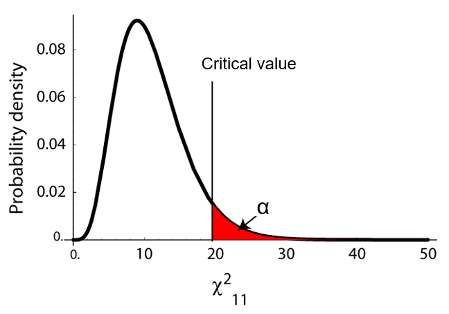
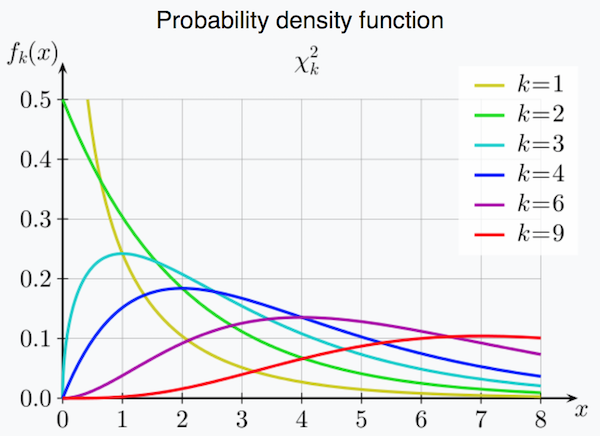

###<span style="color:green">This assignment is due at 11:59 p.m. the day of lab.\span

<span style="color:red">Please submit your lab report by renaming this R Markdown file as "Lab5LastnameFirstname.Rmd" **(please replace Lastname and Firstname with your last and first names, respectively; please do not add spaces, hyphens, or underscores)** and uploading it to the appropriate Lab 5 submission link on Chalk. Please provide answers in this document in the form of <span style="color:blue">blue text</span> and
```{r eval = FALSE}
code chunks #with comments when necessary
```
<span style="color:red">to all green questions. </span>

## Introduction
We can use the $\chi^2$ goodness-of-fit test to test if two (or more) categorical variables are independent or dependent. In this lab we will use data in 2-way contingency tables to test for independence of two random variables. For any hypothesis test, we need a null hypothesis and an alternative hypothesis:

$H_0$:  the two variables are independent

$H_A$: the two variables are *not independent* (ie: they are dependent) 

To test the hypothesis we will calculate the chi-squared statistic ($\chi^2$) for the data. This is a single number, which is computed as a sum over all values of the observed variable as follows:

$$\chi^2 = \sum_i \frac{(\text{observed}_i -  \text{expected}_i)^2}{\text{expected}_i}$$

*Observed* refers to the number of observations in each category, and *expected* denotes the expected number of observations in each category. The observations are provided by the data, but to find $\chi^2$, <span style="color:blue"> we need to calculate the expected values based on the assumption that the variables are independent under the null hypothesis. </span> The larger the differences between the observed and expected frequencies, the larger $\chi^2$ is, and $H_0$ is less likely. 

In order to decide whether or not to reject the hypothesis $H_0$, we have to compare $\chi^2$ to a critical value. The critical value marks the boundry of a specified area in the tail of the sampling distribution under $H_0$. If we want a significance level of $\alpha=0.05$, for example, the critical value indicates the value for which the area under the curve to its right is 0.05. For a chi-squared goodness of fit test, we will use the chi-squared distribution:

<center>

</center>

The significance level for the hypothesis test is $\alpha$, which refers to the probability of rejecting a true null hypothesis by random chance. <span style="color:blue">For instance, if we reject the hypothesis at $\alpha = 0.05$ significance, we're accepting a 5\% chance of falsely rejecting a correct hypothesis. If our $\chi^2$ is larger than the critical value at a given significance level, then it is very unlikely that our assumption under the null hypothesis is true. If this is the case, we reject the null hypothesis. Otherwise we fail to reject $H_0$. </span>

To find the threshold value in R, use the function:

```{r eval = FALSE}
qchisq(P, df)
```

This returns the threshold chi-squared statistic where parameter `P ` equals $1-\alpha$ (1 minus the confidence level) and `df` is the number of degrees of freedom.

The chi-squared distribution has one key parameter, called the number of **degrees of freedom** (d.f.). It is key to note that the probability density function of the chi-squared distribution *changes with the number of degrees of freedom in the system that you are considering*. This is represented by $k$ in the graph below.



When testing for independence between two categorical variables, with respective numbers of categories $M$ and $N$ (i.e. the number of rows and columns in the two-way contingency table for these variables), but **without *a priori* knowledge of the expected numerical breakdown of the categories**, the number of degrees of freedom can be found via:

$$ df = (M-1)(N-1)$$

## Part 1: Independence test for birthdate and thumb-on-top preference
A. Fill out the survey found here (do **not** do this until the actual lab): https://goo.gl/forms/GiXw9jr0FEvKdKK23

B. In lab, we will write the data in a two-way table with thumb-on-top preferences and quarter of birth as the two variables. Together, we will fill out the margins of the 2-way table: the total number of right-thumb and left-thumb preferences, and the total number of 1st quarter, 2nd quarter, 3rd quarter, and 4th quarter births. <span style="color:blue"> Test whether thumb preference and quarter of birth are independent by doing the following:</span>

### Tasks
<span style="color:green">
1. State the null hypothesis for the independence test and the alternative hypothesis.
</span>

<span style="color:blue">The null hypothesis for the independence test is that there is no association between thumb-on-top preferences and quarter of birth. The alternative hypothesis is that there is an association between thumb-on-top preferences and quarter of birth.</span>

<span style="color:green">
2. Calculate the expected counts based on the assumption that the null hypothesis is true. To calculate the expected frequencies, use the fact that if events $A$ and $B$ are independent, $\mathbb{P}(A \text{ and } B) = \mathbb{P}(A)\times \mathbb{P}(B)$ to find the expected probabilities, and then multiply those probabilities by the total number of people to get the expected counts. Perform these calculations by hand and then enter them into a matrix in R. Also put the values from the table we made with the actual values into a matrix in R.</span>

<span style="color:blue">Calculation for the expected value of Total Right in Jan-Mar:  ((36)/(82))*(14/82)* 82  = 6.1 </span> 
 </span>

<span style="color:green">
3.	Write a function that takes in two matrices (observed and expected). Use this function to calculate and return the chi-squared statistic. </span>

```{r}
a<-c(42,36,87,7)
b<-c(43,43,43,43)

x <- matrix(data = a, nrow = 2, ncol = 2)
y <- matrix(data = b,nrow=2,ncol=2)

chiSquareTest <- function(observed,expected){
  count<-0
  for(i in 1:nrow(observed)){
    for(j in 1:ncol(observed)){
      count <- count + (((observed[i,j]-expected[i,j])^2)/(expected[i,j]))
    }
  }
  return(count)
}
#chiSquareTest(x,y)
```


<span style="color:green">
4.	Calculate the chi-squared statistic for the data using the function you wrote above.
</span>

```{r}
#INSERTING VECTORS GOES DOWN COLS

#expected values means we don't see a differnece in the numbers, however many values divided by total.
#expected: for jan-mar: right:  (36)/(82)  * (14/82) * 82 


expectedVals<-c(6.1,7.9,11.0,14.0,10.1,12.9,8.8,11.2)
observedVals <- c(5,9,17,8,9,14,5,15)
aparam<-matrix(data=observedVals,nrow=2,ncol=4)
bparam<-matrix(data=expectedVals,nrow=2,ncol=4)
chiSquareTest(aparam,bparam)
```


<span style="color:green">
5.	Find the threshold chi-squared value using the `qchisq()` function with the correct degrees of freedom and significance levels $\alpha = 0.05, 0.01, 0.001$. Decide whether to reject the null hypothesis at each significance level. </span>

```{r}

#The values returned here have to be less than the p value. 
qchisq(.95,3) # We reject the null hypothesis because the p-value is greater than the threshold value. 
qchisq(0.99,3) # We fail to reject the null hypothesis because the p-value is less than the threshold value. 
qchisq(.999,3) # We fail to reject the null hypothesis because the p-value is less than the threshold value. 
```


## Part 2: Independence test for walking and talking

Falls are extremely dangerous for the elderly; in fact, many deaths are associated with such falls. Some preventative measures are possible, and it would be very useful to have ways to predict which people are at greatest risks for falls. One doctor noticed that some patients stopped walking when they started to talk, and she thought that the reason might be that for these people, it may be a challenge to do more than two things at once. She hypothesized that this might be an indication for future risks, such as for falling, and this led to a study of 172 elderly patients in an assisted living facility.

Of these 172 people, 43 stopped walking in order to talk, while the rest did not. Of these people who stopped walking to talk, 36 had a fall in the next six months. Of the remaining 129 people, 42 had a fall in that same time period.

### Tasks

<span style="color:green">
6.	State the null hypothesis and the alternative hypothesis for the independence test between the risk of falling and needing to stop walking in order to talk.
</span>

<span style="color:blue">null hypothesis: There is no difference in the proprotion of people that stopped walking to talk and people that fall. Alternative: There is a difference in the proportion of people that stopped walking to talk adn people that fall. </span>

<span style="color:green">
7.	Enter the observed values into a matrix in R. Next calculate the expected counts based on the assumption that hypothesis is true (as part 1). Perform these calculations by hand and enter them into a matrix in R.

```{r}
observedFall<-c(36,42,7,87)
x<-matrix(nrow=2,ncol=2,data=observedFall)
expectedVector <- c(19.5,58.5,23.4,70.1)
y<-matrix(nrow=2,ncol=2,data=expectedVector)
```

</span>

<span style="color:green">
8.	Calculate the chi-squared statistic using the function you wrote above.
</span>

```{r}
chiSquareTest(x,y)
```


<span style="color:green">
9.	Find the threshold chi-squared value using the `qchisq()` function with the correct degrees of freedom and significance levels $\alpha = 0.05, 0.01, 0.001$ and decide whether to reject the independence hypothesis at each significance level. 
</span>

```{r}
qchisq(0.95,1) #we reject the null hypothesis because the P-value is greater than the threshold. 
qchisq(0.99,1) #we reject the null hypothesis because the P-value is greater than the threshold
qchisq(0.999,1) #we reject the null hypothesis because the P-value is greater than the threshold. 
```


### Lab 5 Homework

**Due Tuesday, 9 May 2017 at 11:59pm.**

Human names are often of obscure origin, but many have fairly obvious sources. For example, "Johnson" means "son of John," "Smith" refers to an occupation, and "Whitlock" means "white-haired" (from "white locks"). In Lancashire, U.K., a fair number of people are named "Shufflebottom," a name whose origins remain obscure. 

Before children learn to walk, they move around in a variety of ways, with most infants preferring a particular mode of transportation. Some crawl on hands and knees, some belly crawl commando-style, and some shuffle around on their bottoms. A group of researchers decided to ask whether the name "Shufflebottom" might be associated with a propensity to bottom-shuffle. To test this, they compared the frequency of bottom-shufflers among infants with the last name "Shufflebottom" to the frequency for infants named "Walker." (By the way, this study is real. See Fox et al. 2002.)

They found that 11 out of 43 Walkers moved by bottom-shuffling, while 12 out of 45 Shufflebottoms did. Is there a significant difference between the groups?

<span style="color:green">
1.	State the null hypothesis and the alternative hypothesis for the independence test.
</span>

<span style="color:blue"The null hypothesis is that the name 'shufflebottom' cannot be associated with a propensity to bottom-shuffle. The alternative hypothesis is that the name 'shufflebottom' can be associated with a propensity to bottom-shuffle.</span> 

<span style="color:green">
2.	Enter the observed values into a matrix in R. Next calculate the expected counts based on the assumption that hypothesis is true. Perform these calculations by hand and enter them into a matrix in R.
</span>

<span style="color:green">
3.	Calculate the chi-squared statistic using the function you wrote in lab.
</span>

<span style="color:green">
4.	Find the threshold chi-squared value using the `qchisq()` function with the correct degrees of freedom and significance levels $\alpha = 0.05, 0.01, 0.001$ and decide whether to reject the independence hypothesis at each significance level. 
</span>
