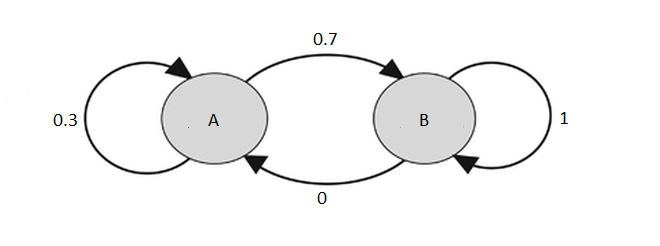

### Lab 6 Homework

<span style="color:red">Due one week after lab at 1:30 p.m.\span

There are many applications for Markov chains in biology! The following two questions were taken from *Quantifying Life: A Symbiosis of Computation, Mathematics, and Biology* by Dmitry A. Kondrashov.

<span style="color:green">
1. The genotype of an organism can be either normal (wild type) or mutant. Each generation, a wild type individual has probability 0.04 of having a mutant offspring, and a mutant has probability 0.006 of having a wild type offspring. Write the transition matrix for this process in R. In the long run, what fraction of organisms will be wild type and which fraction will be mutant? Show your calculations using R.
</span>

```{r}
library(expm)
dataset <- c(0.96,0.04,0.006,0.994)
transitMatrix <- matrix(nrow=2,ncol=2,data=dataset,byrow=TRUE)
transitMatrix

#initially wild type:
probabilitymatrix<-matrix(ncol=2,nrow=1,data=c(1,0))
wildtypeans<-probabilitymatrix%*%(transitMatrix%^%100)
wildtypeans


#In the long run, the fraction of organisms that will be wild type is 0.1382716. In the long run, the fraction of organisms that will be mutant is 0.8617284.
```


<span style="color:green">
2. An ion channel can be in either open or closed state. If it is open, then the probability of closing in 1 microsecond is 0.15; if closed, then the probability of opening in 1 microsecond is 0.35. Write the transition matrix for this process in R. In the long run, what fraction of ion channels will be closed? Show your calculations using R.
</span>

```{r}
iondata2 <- c(0.85,0.15,0.35,0.65)
iondata <- matrix(nrow=2,ncol=2,data=iondata2,byrow=TRUE)

#init: open
ionmat<-matrix(ncol=2,nrow=1,data=c(1,0))
ionans<-ionmat%*%(iondata%^%100)
ionans

#Fraction of ion channels that will be closed is 0.3, and the fraction of ion channels that will be open is 0.7. 

```


In our simulation in lab, we saw that $P_n=PT^n$ approaches a constant, equilibrium vector as $n$ gets bigger. Markov chains with this property are called *regular* Markov chains. However, not all chains are regular. One type of Markov chain that has many applications in biology and medicine is called an *absorbing* Markov chain. In an absorbing Markov chain, there is at least one state called the absorbing state where once the state is entered, you cannot get out. For example, in the following diagram, state B is the absorbing state:   

<center>

</center>

<span style="color:green">
3.	A study conducted at the University of North Carolina Hospitals  used a Markov chain to model three categories of patients: death (0), unfavorable status (1), and favorable status (2). The transition matrix for a cycle of 72 hours was as follows.</span>

<center>

</center>

<span style="color:green">
a.	Enter the values of the given transition matrix into a matrix in R.
</center>

```{r}
data3<-c(1,0,0,0.085,0.779,0.136,0.017,0.017,0.966)
patMat <- matrix(nrow=3,ncol=3,data=data3,byrow=TRUE)
patMat
```


<span style="color:green">
b.	What is the absorbing state? What is the probability that a person with favorable status will eventually end up dead? (You shouldn't need to do any calculations for this part.)
</span>

<span style="color:blue">The absorbing state is death(0) with death(1), row 1 column 1 which has a transition matrix value of 1.0. This is because once the patient dies then they have a 1.0 probabilty or remaining dead, and cannot revert back to eitehr unfavorable or favorable status.  The probabilty that a person with favorable status will eventually end up dead is: 0.017. </span>


<span style="color:green">
c.	What is the probability that a person with favorable status will be dead after 150 days (fifty 72 hour cycles)? You can use the methods you learned in lab to answer this, except the probability matrix will be a 1x3 matrix, and the transition matrix is a 3x3 matrix.</span>

```{r}
library(expm)
probMatrix <- matrix(nrow=1,ncol=3,data=c(0,0,1.0))
newMatrix <- probMatrix%*%(patMat%^%50)
newMatrix

#The probabilty is 0.6689732
```


<span style="color:green">
d.	What is the probability that a patient with unfavorable status will be dead after 150 days?
</span>

```{r}
library(expm)
probMatrix2<-matrix(nrow=1,ncol=3,data=c(0,1,0))
answerMat <- probMatrix2%*%(patMat%^%50)
answerMat

#The probabilty is 0.7733591
```


<span style="color:blue"> In lab, we found that for regular Markov chains the equilibrium probability matrix did not depend on the initial state. We will see though that this is not the case for absorbing matrices with more than two absorbing states. 


<span style="color:green">
4. Suppose researchers use mice to study the problem of mating the offspring from the same two parents; two of their offspring are then mated, and so on. Let A be a dominant gene for some trait, and let a be the recessive gene. The original offspring can carry genes AA, Aa, or aa. There are six possible ways that these offspring can mate: </span>

<center>

</center>

<span style="color:green">
Suppose that the offspring mice are randomly mated with each other. The matrix below is the transition matrix. (You can verify this with some Punnett squares). 
</span>

<center>

</center>

<span style="color:green">
a.	Write the transition matrix as a matrix in R.
</span>

```{r}
datasetmice <- c(1,0,0,0,0,0,0.25,0.5,0,0.25,0,0,0,0,0,1,0,0,(1/16),0.25,(1/8),0.25,0.25,(1/16),0,0,0,0.25,0.5,0.25,0,0,0,0,0,1)
transitMatrixMice <- matrix(nrow=6,ncol=6,data=datasetmice,byrow=TRUE)
transitMatrixMice
```


<span style="color:green">
b.	What are the absorbing states?
</span>

<span style="color:blue">The absorbing states are observed when you cross state 1 (AA and AA) with state 1, state 3(AA and aa) with state 4(Aa and Aa), and state 6 with state 6 (aa and aa).  The values in the transition matrix with these crosses are = to 1. </span>

<span style="color:green">
c.	If the two parents with the genes Aa (state 4) are mated, what does the probability matrix converge to after many generations? Show your calculations using R.
</span>


```{r}
probmatrixmice <- matrix(nrow=1,ncol=6,data=c(0,0,0,1,0,0))
dragonballz <- probmatrixmice%*%(transitMatrixMice%^%50)
dragonballz

# The probability matrix converges to 0.50 after many generations. look at columns 1 and 6 in the dragonballz matrix 
```

<span style="color:green">
d.	If one mouse with an AA genotype and another Aa mouse are mated, what will the probability matrix converge to after many generations?
</span>

```{r}
iamsad<-matrix(nrow=1,ncol=6,data=c(0,1,0,0,0,0))
iamdumb <- iamsad%*%(transitMatrixMice%^%100)
iamdumb

#The probabilty matrix is converging to 0.75 for state 1 and 0.25 for state 6.
```


<span style="color:green">
e.	Compare your answers from parts (c) and (d). What do you notice?
</span>

<span style="color:blue">In (c) the probabilities converged to a 50-50 chance for both states, but for (d) it differed and the probability for state 1 increased and probability for state 6 decreased.</span>