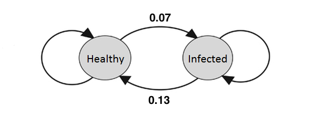

###<span style="color:green">This assignment is due at 11:59 p.m. the day of lab.\span

<span style="color:red">Please submit your lab report by renaming this R Markdown file as "Lab6LastnameFirstname.Rmd" **(please replace Lastname and Firstname with your last and first names, respectively; please do not add spaces, hyphens, or underscores)** and uploading it to the appropriate Lab 6 submission link on Chalk. Please provide answers in this document in the form of <span style="color:blue">blue text</span> and
```{r eval = FALSE}
code chunks #with comments when necessary
```
<span style="color:red">to all green questions. </span>

A Markov model is a stochastic model used to simulate the non-deterministic behavior of a system over discrete intervals. In a system described by a Markov model, <span style="color:blue">the future state of the system is not dependent on its past behavior. Rather, the probability of occupying any particular future state depends solely on the present state.</span> The probabilities of occurrence of each future state are calculated conditional on the present state, and these conditional probabilities are sampled to simulate the progression to the next step. The conditional probability distribution of all states is then re-evaluated with respect to the new state in order to define the sampling distribution for the subsequent step, and so on and so forth. In this way, a Markov trajectory is "memory-less." <span style="color:blue">That is, it retains no memory of the trajectory it took to arrive in its current state, and its future trajectory depends only on the probability distribution defined by its current state.</span>

### A Two-State Markov Model

Suppose there's a viral epidemic within a certain population. There are two possible states for any person in the population: they could either be infected (I) or healthy (H). Let us assume that being previously infected does not affect the chance that one will be infected again in the future. Suppose that for each day, the probability of becoming infected the next day if you are healthy is 0.07, and the probability of recovering from the infection (becoming healthy) if you are sick is 0.13. 

<center>

</center>

<span style="color:green">
1.	What is the probability of a healthy person staying healthy the next day? What is the probability of an infected person still being infected the next day?</span>

<span style="color:blue">The probabilty that a health person stays healthy the next day is (1-0.07) = 0.93. The probabilty that an infected person still being infected the next day: (1-0.13) = 0.87.</span>

Note that the probability of being healthy or infected on day 2 only depends on which state you are in on day 1. In general, the probability of being healthy or infected on any day only depends on which state you are in the day before. 

Given the epidemic, we will certainly have many questions about the fate of the population. If I am healthy today, what is the probability that I will still be healthy a week from now? How many people in the population will become infected after a long time?

We could track the state of an initially healthy individual over 365 days with the following code: 

```{r comment = ''}
days<-365
CURstate<-0 #Let's represent the healthy state with 0 and the infected state with 1
state<-numeric(days)
for(i in 1:days){
  randomNum<-runif(1)  #runif(1) randomly generates a number between 0 and 1   
  if(CURstate==0){
    if(randomNum < .07){
      CURstate <- 1
    }else{
      CURstate <- 0
    }
  }else{
    if(randomNum < .13){
      CURstate<-0
    }else{
      CURstate<-1 
    }
  }
  state[i]<-CURstate
}
state
```

<span style="color:green">
2.	Explain how the code above works in your own words, going line by line. What is the **purpose** (not the *function*) of `runif(1)` in the fifth line? Why does the state of a person change if randomNum < .07? </span>


<span style="color:blue">The code above starts by initially setting up two constant parameters # of days, and sets 0 as the number that represents the healthy state for an individual. Then it creates a vector (state) filled with 365 zeroes, to serve as a placeholer for our final output. Then it loops through for the same number of days that we set initially, and in each loop does the following:</span>

<span style="color:blue">generate a random number using runif, use that random number as a boolean with the predefined probabilities (0.07 and 0.13) to assign different states (cured / infected) for the patient for each of the 365 days. Finally it assigns each position in the state vector to the previously determined state(cured/infected --> (0/1)), and prints out the state vector in the end.  
</span> 

<span style="color:green">
3.	Using the given code, generate a stochastic path for an individual who is initially healthy, over 365 days. Make a plot of the state vector versus number of days with the `plot()` command. Add the parameter `type = "o"` to connect each of the points with a line. Re-run the entire code a few times to see some different possible disease histories. Describe what you see.</span>

```{r}
# made previous Code into function below: 
stPath <- function(initState){
  days<-365
  CURstate<-initState #Let's represent the healthy state with 0 and the infected state with 1
  state<-numeric(days)
  for(i in 1:days){
    randomNum<-runif(1)  #runif(1) randomly generates a number between 0 and 1   
    if(CURstate==0){
      if(randomNum < .07){
        CURstate <- 1
      }else{
        CURstate <- 0
      }
    }else{
      if(randomNum < .13){
        CURstate<-0
      }else{
        CURstate<-1 
      }
    }
    state[i]<-CURstate
  }
  return(state)
}


plot(1:365,stPath(0),type="o")

#Running it a bunch of times shows different frequencies for the healthy and infected individuals. However, each time we run it, the healthy individuals is higher in frequency than infected individuals.
```


<span style="color:green">
4.	Run the same code again but this time, suppose that the individual is initially infected. Plot the state vector. How has it changed?</span> 

```{r}
plot(1:365,stPath(1),type="o")
# The initial state starts as infected. at x=0, y=1.0 which represents infected state.
```


In the questions abovem we've modeled the states of *one individual* through the epidemic, but what about the overall population? Will the disease ever be eradicated, or will everybody in the population eventually become infected? Let's suppose the population consists of 2000 people. Let's define an empty matrix to keep track of this population:

```{r comment = ''}
#PopMat <- matrix(0,nrow = 2000,ncol = days)
```

Each row of `PopMat` corresponds to an individual in the population and the columns correspond to the days. <span style="color:blue">Think of it as if we were just stacking up all of the state vectors from question 2 for each individual on top of each other.</span>

<span style="color:green">
5.	Modify your script from question 2 so that it tracks all 2000 initially healthy individuals from the population over the 365 days (generating 2000 independent paths). To do this, set days to be 365 as you did in question 2 and define PopMat as above. Then nest the code (including the lines that set `CURstate` to 0 and define `state` as an empty numeric vector) from question 2 within another for loop that iterates over *the number of individuals* using the variable j, and save the state vector for each individual in the jth row of `PopMat`. </span>

```{r}
days<-365
PopMat <- matrix(0,nrow = 2000,ncol = days)

for(j in 1:nrow(PopMat)){
  CURstate<-0 #Let's represent the healthy state with 0 and the infected state with 1
  state<-numeric(days)
  for(i in 1:days){
    randomNum<-runif(1)  #runif(1) randomly generates a number between 0 and 1   
    
    if(CURstate==0){
      if(randomNum < .07){
        CURstate <- 1
      }else{
        CURstate <- 0
      }
    }else{
      if(randomNum < .13){
        CURstate<-0
      }else{
        CURstate<-1 
      }
    }
    state[i]<-CURstate
  }
  PopMat[j,]<-state
}
```


<span style="color:green">
6.	Using `PopMat` from question 5, how many individuals were infected on day 1? How many people were infected on day 2? (Remember that each column of `PopMat` represents a day).</span>

```{r}
dayOneCount<-0
dayTwoCount<-0

dayOneCount<-sum(PopMat[,1])
dayTwoCount<-sum(PopMat[,2])

print(paste("On day 1 [",dayOneCount,"] individuals were infected"))
print(paste("On day 2 [",dayTwoCount,"] individuals were infected"))


```


<span style="color:green">
7. Use the function `colSums()` on your matrix `PopMat` to find the number of people who are infected (i.e. are in state 1) for each day of the simulation, and store the resulting vector of column sums as the variable `num_infected`.</span>

```{r}
num_infected<-numeric(365)
num_infected<-colSums(PopMat)
num_infected
```


<span style="color:green">
8. Create a plot of your `num_infected` vector from question 7. Describe what you see. What happens to the number of infected individuals as time goes on?</span>

```{r}
plot(1:365,num_infected,type="o")
#As time goes on, the number of infected individuals icreases rapidly in the initial stages, and stays relatively consistent throughout. 
```


<span style="color:green">
9.	Repeat question 5, but set the initial states of all 2000 individuals to infected (number 1). Now plot your new `num_infected` vector. Compare your results to your plot from question 8.</span>

```{r}
days<-365
PopMat <- matrix(0,nrow = 2000,ncol = days)

for(j in 1:nrow(PopMat)){
  CURstate<-1 #Let's represent the healthy state with 0 and the infected state with 1
  state<-numeric(days)
  for(i in 1:days){
    randomNum<-runif(1)  #runif(1) randomly generates a number between 0 and 1   
    
    if(CURstate==0){
      if(randomNum < .07){
        CURstate <- 1
      }else{
        CURstate <- 0
      }
    }else{
      if(randomNum < .13){
        CURstate<-0
      }else{
        CURstate<-1 
      }
    }
    state[i]<-CURstate
  }
  PopMat[j,]<-state
}

num_infected<-numeric(365)
num_infected<-colSums(PopMat)
plot(1:365,num_infected,type="o")

#Now number of infected individuals is high initially, and rapidly decreases as time increases, and stays consistently low throughout.
```


As I'm sure you've noticed, our code to model the projection of the disease has gotten a bit unruly. Modeling Markov chains with matrices is another approach that we can use. Markov models describe random transitions between discrete states with discrete time steps. We need two matrices: a probability matrix and a transition matrix. For this scenario, the probability matrix will be a 1x2 matrix (1 row, 2 columns) that tells us the **probabilities of currently being in each state**. Let's assume that the first column represents the healthy state and the second column represents the infected state. For example, if we know that an individual is currently healthy, then the probability matrix would be: 

<center>

</center>

<span style="color:green">
10.	Write the probability matrix in R for an individual who is currently infected.  </span>

```{r}
v<-c(0,1)
P <- matrix(nrow=1,ncol = 2, data=v)
#Col 1: probabilty of being healthy
#Col 2: probability of being infected. 
```


The transition matrix is a 2x2 matrix that tells us the **probabilities of transitioning to a state on the next day**. Each row of the transition matrix corresponds to a current state, and the columns represent the possible future states. Take a look at the blank transition matrix (called $T$) for our scenario:

<center>

</center>

If $i$ represents the day, the number that will go in the second row and first column of $T$ is the probability of being healthy on day $i+1$ (the next day) given that you are infected on day i. (Remember from conditional probability, we can represent this as $\mathbb{P}(H_{i+1} | I_i )$.)  From above, we know that $\mathbb{P}(H_{i+1} | I_i )=0.13$, so the transition matrix becomes

<center>

</center>

<span style="color:green">
11.	Use the given transition probabilities and the probabilities calculated in question 1 to finish filling in the transition matrix $T$. Write this matrix in R.</span>

```{r}
x<-0.93
y<-0.07
z<-0.87
t<-c(x,0.13,y,z)
T<-matrix(ncol=2,nrow=2,data=t)
T
```


<span style="color:green">
12.	Execute the command `rowSums(T)` in R to find the sum of each row of the transition matrix. **What do you get?** This is the case for any Markov transition matrix. **Why?** </span>

```{r}
rowSums(T)
#You get 1 for each row of the transition matrix, because probaiblties should always add up to one for each each row. 
```


Now that we have the probability matrix and the transition matrix, we can figure out the probability of an individual being infected or healthy on the next day. All we need to do is to use matrix multiplication to multiply: `P_1 <- P%*%T` (remember that `%*%` is the command in R for matrix multiplication). Since `P` is the initial 1x2 probability matrix, this will give us a new 1x2 matrix `P_1`, which is the new probability matrix for one day afterwards. In this new probability matrix, the first column still represents the probability of being healthy, and the second column still represents the probability of being infected.


<span style="color:green">
13.	If an individual is initially healthy, what is the probability that they are infected and the probability that they are healthy after one day?</span>

```{r}
qw<-c(1,0)
Q <- matrix(nrow=1,ncol=2,data=qw)
P_1<-Q%*%T
P_1
```

<span style="color:blue">The probability that an initially health individiual is infected is 0.87 and the probability that they are healthy is 0.13 after one day.</span>

**Since the transition probabilities never change, we can calculate the probabilities of being infected and healthy on the third day the same way.**

<span style="color:green">
14.	What is the probability that an individual who is initially healthy is infected three days later? What is the probability that the same individual is healthy four days after the initial day?</span>
```{r}
P_2<-P_1%*%T
P_2
P_3<-P_2%*%T
P_3

P_4<-P_3%*%T
P_4
```


<span style="color:blue">The probabilty that an individual (initially healthy) is infected three days later is: 0.1708, and the probability that the individual (initially healthy) is healthy 3 days later is: 0.8292. For four days later: the probability that an individiual (initially healthy) is infected is 0.20664, and probability that the individual (initially healthy) remains healthy is 0.79336.</span>

You may have started to notice a pattern: in general, if we want to find the probability matrix `P_n` after $n$ days have gone by, we can use the equation:

<center>

</center>

Here, `P` is the initial probability vector for day 1, and `P_n` is the probability vector on day $n$. In order to compute the powers of a matrix in R, we need to install a package first. Execute the following commands **in your console**: 

```{r eval = FALSE}
install.packages("expm")
library(expm)
```

With this new expm package, we can calculate the powers of matrix T for any $n$ by writing: `T%^%n`.

<span style="color:green">
15.	***Include the line `library(expm)` before your code for this question.*** What is the probability matrix of an initially healthy individual 10 days later? What is the probability matrix of an initially healthy individual 100 days later?</span>

```{r}
sadf<-c(1,0)
P23<-matrix(nrow=1,ncol=2,data=sadf)

library(expm)
print("10 days later:")
PM_10<-P23%*%(T%^%10)
PM_10

print("100 days later:")

PM_100<-P23%*%(T%^%100)
PM_100
```


<span style="color:green">
16.	Repeat question 15, but suppose that the individual is initially infected. Compare the probability matrices with the matrices from question 15. Do you notice anything interesting?</span>


```{r}
qwer<-c(0,1)
P420<-matrix(nrow=1,ncol=2,data=qwer)
library(expm)
print("10 days later:")
PM_10<-P420%*%(T%^%10)
PM_10

print("100 days later:")

PM_100<-P420%*%(T%^%49)
PM_100

#The probabilty for the 100 days later is the same, but the probabilies for being healthy 10 days later after being initially infected is smaller(0.6875 vs 0.5802), and the probability for being infected 10 days later after being initially infected is larger(0.312419 vs. 0.419) .
```


<span style="color:green">
17.	Approximately how many days does it take for the distributions to converge (ie: how many days does it take for the probability matrices to stop changing)? Compare the probability matrices between the individual who was initially healthy and the individual who was initially infected.</span>

<span style="color:blue">The distributions converge around 49 days. At 49 days, the values reach 0.65 and 0.35, and do not change after that. The probabilty for the 100 days later is the same, but the probabilies for being healthy 10 days later after being initially infected is smaller(0.6875 vs 0.5802), and the probability for being infected 10 days later after being initially infected is larger(0.312419 vs. 0.419).</span>


<span style="color:green">
18.	Based on your observations in questions 16 and 17, what will eventually happen to the population after the infectious disease is introduced?</span>

<span style="color:blue">After 49 days have passed, 65% of the population would be healthy, and 35% would be infected.</span>

<span style="color:green">
19. Does the initial probability distribution affect the equilibrium probability distribution?
</span>


<span style="color:blue">The initial probability distribution does not affect the equilbrium probability distribution. We can see that from the previous calculations the probability calculations are the same. The probability for 100 days later stays the same regardless of whether you start infected or healthy and this is shown in question sixteen./span>

<span style="color:green">
20.	Suppose that the virus causing the disease mutates so that its infection rate (transition from H to I) changes to 0.4. Repeat the computations from question 17. What eventually happens to the population after the mutated virus is introduced?</span>
```{r}
x<-0.6
y<-0.4 #change to 0.4
z<-0.87
t<-c(x,0.13,y,z)
T<-matrix(ncol=2,nrow=2,data=t)

library(expm)
sadf<-c(1,0)
P23<-matrix(nrow=1,ncol=2,data=sadf)
print("ten days later:")
PM_10<-P23%*%(T%^%10)
PM_10

print("100 days later:")
PM_100<-P23%*%(T%^%100)
PM_100

qwer<-c(0,1)
P420<-matrix(nrow=1,ncol=2,data=qwer)
library(expm)
print("breakbreakbreakbreak")
print("10 days later:")
PM_10<-P420%*%(T%^%10)
PM_10
print("100 days later:")
PM_100<-P420%*%(T%^%100)
PM_100


#The distributions converge at day 20, if you change the 100 to a 20 in line 410, you can see the convergence. Probabilty of being healthy 10 days later after being initially infected gets a little bit smaller (0.24568 vs 0.245154), and the probabilty of being infected 10 dayss after you are initially infected gets larger(0.75432 vs 0.754846), Thus, 20 days after you introduce the mutated virus, about 25% of the population will become healthy, and 75% would be infected. 
```


### Lab 6 Homework

<span style="color:red">Due one week after lab at 1:30 p.m.\span

There are many applications for Markov chains in biology! The following two questions were taken from *Quantifying Life: A Symbiosis of Computation, Mathematics, and Biology* by Dmitry A. Kondrashov.

<span style="color:green">
1. The genotype of an organism can be either normal (wild type) or mutant. Each generation, a wild type individual has probability 0.04 of having a mutant offspring, and a mutant has probability 0.006 of having a wild type offspring. Write the transition matrix for this process in R. In the long run, what fraction of organisms will be wild type and which fraction will be mutant? Show your calculations using R.
</span>

<span style="color:green">
2. An ion channel can be in either open or closed state. If it is open, then the probability of closing in 1 microsecond is 0.15; if closed, then the probability of opening in 1 microsecond is 0.35. Write the transition matrix for this process in R. In the long run, what fraction of ion channels will be closed? Show your calculations using R.
</span>

In our simulation in lab, we saw that $P_n=PT^n$ approaches a constant, equilibrium vector as $n$ gets bigger. Markov chains with this property are called *regular* Markov chains. However, not all chains are regular. One type of Markov chain that has many applications in biology and medicine is called an *absorbing* Markov chain. In an absorbing Markov chain, there is at least one state called the absorbing state where once the state is entered, you cannot get out. For example, in the following diagram, state B is the absorbing state:   

<center>

</center>

<span style="color:green">
3.	A study conducted at the University of North Carolina Hospitals  used a Markov chain to model three categories of patients: death (0), unfavorable status (1), and favorable status (2). The transition matrix for a cycle of 72 hours was as follows.</span>

<center>

</center>

<span style="color:green">
a.	Enter the values of the given transition matrix into a matrix in R.
</center>

<span style="color:green">
b.	What is the absorbing state? What is the probability that a person with favorable status will eventually end up dead? (You shouldn't need to do any calculations for this part.)
</span>

<span style="color:green">
c.	What is the probability that a person with favorable status will be dead after 150 days (fifty 72 hour cycles)? You can use the methods you learned in lab to answer this, except the probability matrix will be a 1x3 matrix, and the transition matrix is a 3x3 matrix.</span>

<span style="color:green">
d.	What is the probability that a patient with unfavorable status will be dead after 150 days?
</span>

<span style="color:blue"> In lab, we found that for regular Markov chains the equilibrium probability matrix did not depend on the initial state. We will see though that this is not the case for absorbing matrices with more than two absorbing states. 

<span style="color:green">
4. Suppose researchers use mice to study the problem of mating the offspring from the same two parents; two of their offspring are then mated, and so on. Let A be a dominant gene for some trait, and let a be the recessive gene. The original offspring can carry genes AA, Aa, or aa. There are six possible ways that these offspring can mate: </span>

<center>

</center>

<span style="color:green">
Suppose that the offspring mice are randomly mated with each other. The matrix below is the transition matrix. (You can verify this with some Punnett squares). 
</span>

<center>

</center>

<span style="color:green">
a.	Write the transition matrix as a matrix in R.
</span>

<span style="color:green">
b.	What are the absorbing states?
</span>

<span style="color:green">
c.	If the two parents with the genes Aa (state 4) are mated, what does the probability matrix converge to after many generations? Show your calculations using R.
</span>

<span style="color:green">
d.	If one mouse with an AA genotype and another Aa mouse are mated, what will the probability matrix converge to after many generations?
</span>

<span style="color:green">
e.	Compare your answers from parts (c) and (d). What do you notice?
</span>

